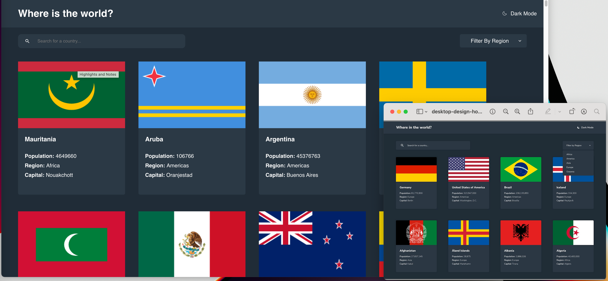
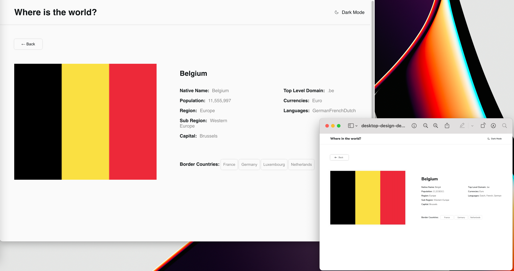

# Country API in React & TypeScript :rainbow_flag:

<p>

</p>
<p>

</p>

### Table of Contents

- [Description](#description)
- [Technologies](#technologies)
- [What I learned](#what-i-learned)
- [License](#license)
- [Author Info](#get-in-touch)

---

## Description

This is a solution to the [REST Countries API with color theme switcher challenge on Frontend Mentor](https://www.frontendmentor.io/challenges/rest-countries-api-with-color-theme-switcher-5cacc469fec04111f7b848ca). All code are original.

The app can be accessed at the link below.

> https://ran-country-api.netlify.app/

---

## Technologies

- Frontend: React.js, TypeScript, HTML & CSS

---

## What I learned

- useContext

```ts
/* First create a ThemeContext */
export const ThemeContext = React.createContext({
  theme: themes.dark,
  setThemeToggle: (theme: any) => {},
});

/* Second create a ThemeProvider */
export const ThemeProvider = ({ children }: { children: ReactNode }) => {
  const [theme, setThemeToggle] = useState(themes.dark);

  const value = { theme, setThemeToggle };

  return (
    <ThemeContext.Provider value={value}>{children}</ThemeContext.Provider>
  );
};

/* Thrid wrap the ThemeProvider around components need it */
<ThemeProvider>
  <Header />
  <Routes>
    <Route path="/" element={<Home />} />
    <Route path="/country/:name" element={<CountryDetail />} />
  </Routes>
</ThemeProvider>;

/* Last useContext */
function Header() {
  const { theme, setThemeToggle } = useContext(ThemeContext);

  const toggleTheme = () =>
    setThemeToggle((prev: any) =>
      prev === themes.light ? themes.dark : themes.light
    );
  return (
    <header
      style={{
        backgroundColor:
          theme === themes.dark ? theme.element : theme.background,
        color: theme.font,
        boxShadow: theme === themes.dark ? "" : "rgb(0 0 0 / 22%) 0px 0px 3px",
        position: theme === themes.dark ? "static" : "relative",
        zIndex: 10,
      }}
    >
      <h2>Where is the world?</h2>
      <div className="dark-mode" onClick={toggleTheme}>
        {theme === themes.dark ? (
          <Icon icon="ph:moon-light" color="white" />
        ) : (
          <Icon icon="ph:moon-light" />
        )}

        <p>Dark Mode</p>
      </div>
    </header>
  );
}
```

## License

MIT License

---

## Get in touch

<div>
  <a href="https://www.instagram.com/ranwren/">
    <div>@ranwren</div>
    
  </a>
<a href="https://www.linkedin.com/in/ding-ran/">
  <div>@Ran Ding</div>
    
  </a>
</div>

[Back To The Top](#)
